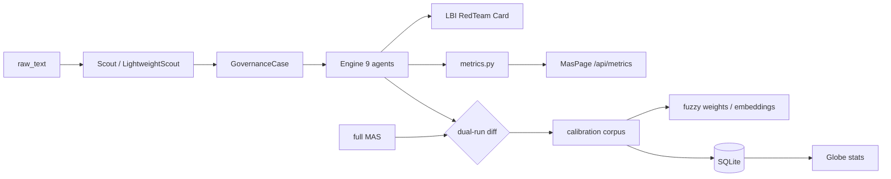

# Claude analysis - engine v1 state (cross-validated)

> **Date:** 2026-06-01 · **Tested:** Cursor (pytest + smoke run)  
> Connections: [[errorlogy-mas - active MVP (Claude)]] · [[Taxonomy vs Engine - formalization gap]] · [[MAS - orchestrator metrics]]

Cross-validation of Claude Code analysis against the current repo `errorlogy-mas/` + `errorlogy-gui/`.

---

## 1. Engine structure (confirmed)

| Engine (9) | Module | LLM (5) |
|------------|--------|---------|
| wms | `engine/wms.py` | scout |
| classifier | `engine/fuzzy.py` | lbi |
| alpha | `engine/alpha.py` (networkx) | red_team |
| pno | `engine/pno.py` | card_compiler |
| acc | `engine/acc.py` | neutrality |
| egd, t4d, cat, fpd | keyword/rules/sigmoid | |

Additionally: `mas/metrics.py`, GUI MasPage/GlobePage, `/api/metrics`, `/api/stats/countries`.

**Tests:** 16/16 pytest green.

---

## 2. What works well (confirmed)

- `guards.py` — μ-cap weak evidence (≤0.65)
- `fuzzy.py` - atomic + universe scoring (317+ modes)
- `alpha.py` — networkx propagation, not LLM
- `engine_only=True` - reproducible pipeline without LLM
- **Metrics** - see §3.1 (corrected after analysis by Claude)

---

## 3. System problems

### 3.1 ~~Critical: metrics are not in the orchestrator~~ → **FIXED v0.2.2**

Claude analyzed the version **before** wiring. Now in `orchestrator.py`:

- `start_run` / `finish_run` — full + engine_only paths
- `track_engine("wms"|"classifier"|…)` — all 9 engine steps
- `record_llm()` - via `agents/base.py` `_call()`
- `metadata.pipeline_metrics` - in `CaseAnalysis`

Smoke: engine run → **9 steps** in metrics, `pipeline_metrics in meta: True`.

GUI `/#/mas` shows data **after at least one Analyze** in an API session.

### 3.2 Fuzzy Calibration - **confirmed**

```python
# engine/fuzzy.py::score_mode — hardcoded, not calibrated
mu = 0.35*dimension + 0.25*keyword + 0.20*signal + 0.10*layer + 0.10*boost
```

There is no feedback loop from labeled cases.

### 3.3 PNO - **partially confirmed**

| Claude's Statement | Fact |
|---------------------|------|
| `_family_weights()` dead code | ✅ not called |
| JSON without `components` → zero speed | ❌ **components are** in v16 (`composite_patterns.PNO[].components.{CB,SF,MP}`) |
| Scoring only family-boost | ❌ `score_pno` reads components + layer boost |

Check: smoke run → `dominant_pno = PNO-1` (not zero profile).

**Tech debt:** remove `_family_weights()`; align ID `PNO-001` vs `PNO-1` in naming.

### 3.4 T4D / EGD - **confirmed**

- `t4d.py` - `_STAGE_KEYWORDS` with `"1977"`, `"teleconference"`, `"explosion"` → Challenger-biased
- `egd.py` - hardcoded `CB-019`, `CB-028`, `CB-027`

For non-English/non-catastrophe cases there is a risk of false classification.

### 3.5 CAT - **confirmed**

5 lambda rules; fallback `CAT-000`. CAT-002 depends on `"capacity" in cluster_name.lower()` - fragile.

### 3.6 Globe seed - **confirmed**

`country_stats_seed.json` is static; Analyze results do not persist → Globe does not update automatically.

---

## 4. System solution (Claude) - agreed

### Level 1 - Bootstrap corpus

Full MAS on 5 seed cases OLD SKETCH → `CaseAnalysis` as pseudo-ground-truth → `scipy.optimize` for fuzzy weights.

### Level 2 - LLM→Engine→LLM sandwich

Scout already structures the entry. **Gap:** `engine_only` uses `_heuristic_weak_signals` (keyword).  
**Proposal:** LightweightScout - 1 LLM call only for the structure, the rest is the engine.

### Level 3 - Dual-run self-calibration

```
engine_only (0.5s) vs full MAS (60–120s)
→ diff top_modes/pno/cat
→ RedTeam flags → human queue → weight updates
```

### Taxonomy: embeddings instead of TF-IDF

`sentence-transformers/paraphrase-multilingual-MiniLM-L12-v2` - multilingual, local, ~420MB.

Precompute `embed(operational_signal)` per mode at taxonomy load.

→ see [[Taxonomy vs Engine - formalization gap]] L2–L5.

---

## 5. Priority queue (updated status)| # | Problem | Status | Difficulty |
|---|--------|--------|-----------|
| 1 | Metrics → orchestrator | ✅ v0.2.2 | — |
| 2 | PNO dead code + ID fix | ✅ TZ-001 | — |
| 3 | Import 5 seed cases | ✅ TZ-003 (`scripts/seed_corpus.py`) | — |
| 4 | Dual-run comparison | ✅ `?dual_run=true`, `mas/dual_run.py` | — |
| 5 | Sentence embeddings | ✅ `mas/engine/embeddings.py` (fallback TF-IDF) | — |
| 6 | SQLite persistence | ✅ `mas/db.py`, `pipeline_runs` | — |
| 7 | T4D/EGD de-Challengerize | ✅ TZ-001 (EGD synthetic removed) | — |
| 8 | Globe ← analyze results | ✅ `country_stats_globe()` + DB-first API | — |
| 9 | LightweightScout | ✅ `?structure_only=true` | — |
| 10 | Metrics persist | ✅ `pipeline_runs` + MasPage merge | — |

### Feedback after implementation (2026-06-01)

- Seed corpus: cases **different** (chernobyl → CAT-003, iraq → MP-005 μ=0.94); 4/5 CAT-000 - normal for a heuristic engine.
- CEP is the same 0.269 for all seeds - weak signals heuristic gives one WMS profile; need calibration or LightweightScout.
- Embeddings: `ERRORLOGY_USE_EMBEDDINGS=0` for quick tests; model download when you first turn it on.
- Globe API: `source: database` when DB is not empty; seed fallback saved.

---

## 6. Mermaid - target architecture v2



---

## Tags

#analysis #claude #engine #calibration #v2 #cross-validated

→ [[00 - Home]] · [[For AI agents]]