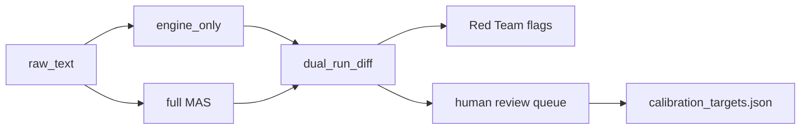

# Roadmap — MAS & Math Development TZ

> **Статус:** ACTIVE · **Дата:** 2026-06-13  
> **Область:** `errorlogy-mas/`, `errorlogy-gui/`, таксономия v16  
> **Связи:** [[Таксономия vs Engine — formalization gap]] · [[Roadmap — implementation log]] · [[errorlogy-mas — активный MVP (Claude)]] · [[Ingest — info stream layer]] · [[MAS — метрики оркестратора]]

---

## Executive summary

Errorlogy MVP — это **AI MAS из 14 LLM/engine-агентов**, а не симуляция человеческих правительств. Числа (μ, MSI, CEP, PNO, ACC, CAT, FPD) считаются детерминированно в `mas/engine/`; LLM извлекает структуру кейса, пишет narrative и проходит guards (μ ≠ вероятность, без юридических обвинений). Baseline v1-math реализован: pytest green, SQLite persistence, ingest layer с US gov fetchers (порт democracy-monitor), dual-run, embeddings, калибровка fuzzy на 5 seed-кейсах.

**Главный разрыв:** онтология v16 (381 mode, HM/GT/LAC/LCC/METHODS) опережает engine (~10–20% формализации). Scout использует ad-hoc vocabulary для weak signals вместо WMS-001..020; CEP на seed-кейсах почти константен; cross-gov Homo-MAS (MAS1/MAS2, meta X, PNO-007 anticonsensus) — концепт, не код.

**Стратегия на 18 месяцев:** три горизонта без over-engineering — (H1) инженерная зрелость и corpus 20→200; (H2) Weak Signal Layer с таксономией + time series; (H3) Homo-MAS dynamics как отдельный simulation module, не подмена AI pipeline. Внешние best practices: verifier/supervisor MAS (Smurfs, MAESTRO), evidence hierarchy fusion (Bayesian MAP, weighted D-S), Hawkes для CEP persistence, FJ opinion dynamics для HM/PNO-007, rule-based CAT (уже есть) + critical transitions literature.

---

## Текущая baseline (что есть)

### AI MAS pipeline (14 агентов)

```text
Scout → WMS → Classifier → Alpha → PNO → ACC → EGD → T4D → CAT → FPD → LBI
      → Red Team → Card Compiler → Neutrality Audit
         └──────────── engine (deterministic) ──────────────┘
```

| Компонент | Путь | Статус |
|-----------|------|--------|
| Оркестратор | `errorlogy-mas/mas/orchestrator.py` | ✅ full + `engine_only` + `structure_only` |
| Engine v1-math | `errorlogy-mas/mas/engine/` (9 модулей + guards) | ✅ детерминизм, unit tests |
| Схемы выхода | `errorlogy-mas/mas/schemas/analysis.py` | ✅ единый контракт |
| Онтология | `errorlogy-mas/data/errorlogy_unified_taxonomy_v16.json` | ✅ 381 mode, 217 atomic, α-edges |
| Multi-LLM router | `errorlogy-mas/mas/providers/` | ✅ fallback по ролям |
| Dual-run | `errorlogy-mas/mas/dual_run.py` | ✅ Jaccard + PNO/CAT diff |
| Метрики | `errorlogy-mas/mas/metrics.py` + persist в SQLite | ✅ |
| DB | `errorlogy-mas/mas/db.py` | ✅ cases, pipeline_runs, signal_timeseries |
| Seed corpus | `errorlogy-mas/scripts/seed_corpus.py` | ⚠️ **5 кейсов** (не 200 из ТЗ) |
| Ingest | `errorlogy-mas/mas/ingest/` | ✅ RSS, URL, US gov APIs, web search |
| US gov fetchers | `federal_register`, `courtlistener`, `govinfo`, `oig`, `legiscan` | ✅ порт [democracy-monitor](https://github.com/agile-explorations/democracy-monitor) |
| Embeddings | `errorlogy-mas/mas/engine/embeddings.py` | ✅ MiniLM + TF-IDF fallback |
| Калибровка μ | `scripts/calibrate_fuzzy.py`, `data/fuzzy_weights.json` | ✅ на 5 targets |
| GUI | `errorlogy-gui/` Electron 0.2.x | ✅ Analyze, Globe, MAS metrics, Info Stream |
| FastAPI | `errorlogy-mas/api/main.py` | ✅ analyze, ingest, metrics, stats |

### Что в taxonomy заявлено, но не в engine

См. [[Таксономия vs Engine — formalization gap]]: METHODS (42), LCC, LAC (Shapley), GT/HM/GT_EXT, LCJ, LΩ, SOCIAL_MEDIA — **0–5% кодирования**. Meta-dimension X (anticonsensus) и PNO-007 описаны в JSON, но не моделируются как динамика агентов.

### Homo-MAS vs AI MAS (важное различие)

| | AI MAS (реализовано) | Homo-MAS (онтология) |
|--|----------------------|----------------------|
| Агенты | Scout, WMS, Classifier… | govA, govB, homo-agents, ACC clusters как **люди/институции** |
| Назначение | Анализ текста governance-события | Модель cross-gov consensus / anticonsensus (HM-001..020, PNO-007) |
| Где в коде | `mas/agents/`, `mas/engine/` | Только JSON + Obsidian [[Таксономия/Расширенные/HM — Homo-MAS pathologies]] |
| Horizon | H1–H2 | H3 |

---

## Принципы развития (AI MAS vs Homo-MAS, μ≠probability, no legal accusations)

1. **Engine-first:** любая новая числовая логика — в `mas/engine/`, pytest, без LLM-арифметики (`errorlogy-mas/AGENTS.md`).
2. **μ — степень принадлежности режиму, не P(guilt), не evidence grade.** Отдельно: `confidence`, `evidence_grade`, `scenario_probability` (`mas/engine/guards.py` cap μ≤0.65 при weak evidence).
3. **Язык публичной карточки:** analytical contribution, early-warning hypothesis — никогда guilty/criminal/corrupt без legal layer (LCJ — будущий модуль).
4. **AI MAS ≠ Homo-MAS:** AI pipeline анализирует **документы и сигналы**; Homo-MAS — **simulation layer** для institutional dynamics (H3), не замена Scout.
5. **Не over-engineer:** не переносить LangGraph/THP целиком; заимствовать **паттерны** (verifier, state, traces), не framework migration на H1.
6. **Таксономия — LΩ candidate, не frozen API:** изменения modes → proposal + migration script.
7. **Ingest ≠ analytics:** OpenClaw/cron — оркестрация сбора; math остаётся в engine (`[[Ingest — info stream layer]]`).
8. **Dual-run as gate:** расхождение engine vs full MAS → human review queue, не silent overwrite weights.

---

## Horizon 1 (0–2 мес) — engineering TZ

**Цель:** production-ready MVP loop: ingest → analyze → persist → GUI; corpus и Scout-WMS alignment; observability.

### TZ-H1-01: Corpus expansion 5 → 20

| Поле | Значение |
|------|----------|
| Файлы | `scripts/seed_corpus.py`, `data/calibration_targets.json`, OLD SKETCH `cases/` |
| Задача | Импорт 15 labeled кейсов (USA, UK, EU, RUS, global disasters + gov failures) |
| Критерии приёмки | ≥20 записей в `cases`; `calibrate_fuzzy.py` сходится; top-5 μ differs across ≥80% pairs; pytest green |
| Не делать | 200 кейсов (отложить на H2) |

### TZ-H1-02: Scout → WMS taxonomy binding

| Поле | Значение |
|------|----------|
| Файлы | `mas/agents/scout.py`, `mas/schemas/case.py`, `mas/engine/wms.py`, taxonomy WMS block |
| Задача | `WeakSignal.signal_type` ∈ {WMS-001..020}; validation + fallback heuristic с mapping table |
| Критерии | 100% signals в ingest/analyze имеют typed ID или explicit `WMS-UNK`; CEP variance на 20 seed > 0.05 std |
| Тест | `tests/test_wms.py` + новый `test_scout_wms_ids.py` |

### TZ-H1-03: Ingest scheduler

| Поле | Значение |
|------|----------|
| Файлы | `scripts/fetch_gov_media.py`, `api/routers/ingest.py`, optional `scripts/cron_ingest.ps1` |
| Задача | Документированный cron (6h/24h); idempotent fetch; alert on new `signal_timeseries` |
| Критерии | 7-day run log; duplicate docs < 1%; `GET /api/ingest/status` shows last_run |

### TZ-H1-04: SSE live progress

| Поле | Значение |
|------|----------|
| Файлы | `api/routers/analysis.py`, `mas/orchestrator.py`, `errorlogy-gui/` Analyze page |
| Задача | `GET /api/analyze/stream` или SSE endpoint; шаги из `track_engine` / agent_id |
| Критерии | GUI показывает real step names (не fake timer); reconnect on disconnect |

### TZ-H1-05: PNO/GT naming debt

| Поле | Значение |
|------|----------|
| Файлы | `mas/engine/pno.py`, taxonomy `composite_patterns.PNO` |
| Задача | Единый ID schema PNO-1 vs PNO-001; удалить мёртвый код; document mapping |
| Критерии | Zero alias bugs in API `/api/taxonomy/mode/` |

### TZ-H1-06: Red Team ← dual_run integration

| Поле | Значение |
|------|----------|
| Файлы | `mas/dual_run.py`, `mas/agents/red_team.py`, `POST /api/analyze?dual_run=true` |
| Задача | Red Team получает `dual_run_diff.flags` автоматически |
| Критерии | Challenger dual-run → flags in `red_team_review`; `needs_human_review` surfaced in GUI |

### TZ-H1-07: OpenTelemetry export (optional)

| Поле | Значение |
|------|----------|
| Файлы | `mas/metrics.py`, `requirements-math-optional.txt` |
| Задача | OTLP exporter для engine/LLM spans (совместимость с OpenClaw diagnostics) |
| Критерии | Grafana/Jaeger видит 14 agent spans per run |

**H1 Definition of Done (горизонт):** pytest ≥40 tests; 20 seed cases; WMS typed; cron ingest 7d; SSE в GUI; dual-run → Red Team; документ обновлён в [[Roadmap — implementation log]].

---

## Horizon 2 (2–6 мес) — Weak Signal Layer TZ

**Цель:** превратить WMS из «MSI на ad-hoc signals» в **persisted early-warning layer** с multisource fusion и time series.

### TZ-H2-01: Signal time series engine

| Поле | Значение |
|------|----------|
| Файлы | `mas/db.py` (`signal_timeseries`), `mas/engine/wms.py`, новый `mas/engine/cep_series.py` |
| Математика | CEP(t) = decay·CEP(t-1) + MSI(t); опционально **discrete Hawkes** intensity λ(t) для burst detection |
| Источник | [Bayesian spatiotemporal Hawkes for conflict](https://arxiv.org/html/2408.14940v1); [social unrest cascades](https://journals.plos.org/plosone/article?id=10.1371/journal.pone.0128879) |
| Критерии | Globe `last_signal_at` обновляется из ingest; anomaly flag when λ > threshold |

### TZ-H2-02: Evidence fusion for weak signals

| Поле | Значение |
|------|----------|
| Файлы | новый `mas/engine/fusion.py`; интеграция в `wms.py` |
| Математика | **Tier A:** weighted Bayesian MAP (direct/indirect/contextual evidence) — [OSINT sensor fusion](https://arxiv.org/html/2605.22259). **Tier B (optional):** improved D-S with conflict weighting — не default |
| Критерии | Fusion повышает MSI stability на synthetic conflicting sources; unit tests; μ still capped by guards |
| Anti-pattern | Full D-S на 20 weak sources → counter-intuitive; использовать distance-weighted fusion |

### TZ-H2-03: Multisource ingest enrichment

| Поле | Значение |
|------|----------|
| Файлы | `data/ingest_sources_us.json`, `data/ingest_feeds.json`, fetchers |
| Задача | EU/UK analogues (NAO, EUR-Lex RSS); environment tags per WMS source_environment |
| Референс | [democracy-monitor](https://github.com/agile-explorations/democracy-monitor) data collection patterns (без их AI assessment pipeline) |
| Критерии | ≥3 environments per active country stream |

### TZ-H2-04: Corpus 20 → 100 (calibration L3)

| Поле | Значение |
|------|----------|
| Файлы | `scripts/calibrate_fuzzy.py`, `mas/engine/embeddings.py`, `data/calibration_targets.json` |
| Математика | Embedding cosine + optimized fuzzy weights (scipy L-BFGS-B) |
| Критерии | Formalization L3 ([[Таксономия vs Engine — formalization gap]]); hold-out 20% macro-F1 on mode labels |

### TZ-H2-05: TIBlender-style cross-validation (lightweight)

| Поле | Значение |
|------|----------|
| Файлы | `mas/agents/scout.py`, optional `mas/ingest/fetchers/` |
| Паттерн | Independent extractor + verifier pass (Smurfs Verifier Agent) — [Smurfs arxiv](https://arxiv.org/html/2405.05955v2) |
| Критерии | Scout+Verifier disagree → `evidence_grade=weak` auto; не full TIBlender clone |

### TZ-H2-06: METHODS plugin scaffold

| Поле | Значение |
|------|----------|
| Файлы | новый `mas/engine/methods/`; registry в taxonomy METHODS IDs |
| Задача | 2 plugins: WMS-M (fusion), ACC-M (cluster re-score) — stub interface |
| Критерии | `run_engine_from_case(..., methods=["WMS-M"])` extensible without orchestrator rewrite |

**H2 Definition of Done:** CEP time series на ingest; fusion module tested; 100 labeled cases; ≥2 METHODS plugins; Globe live signals.

---

## Horizon 3 (6–18 мес) — Homo-MAS consensus dynamics TZ

**Цель:** кодировать **institutional interaction** (не AI agents) для cross-gov anticonsensus, HM pathologies, GT checks — как **simulation/annotation layer** поверх ACC/PNO.

### TZ-H3-01: Homo-MAS graph model

| Поле | Значение |
|------|----------|
| Файлы | новый `mas/engine/homo_mas.py`; taxonomy `homo_mas_interaction_pathologies` |
| Математика | **Friedkin-Johnsen** на signed graph: x(t+1) = S W x(t) + (I-S)s — [FJ boundary-value](https://arxiv.org/html/2602.08704v1), [signed FJ polarization](https://arxiv.org/pdf/2407.10680) |
| Mapping | govA/govB = boundary stubborn agents; ACC clusters = interior nodes; HM-012 bifurcation ↔ PNO-007 |
| Критерии | Steady-state polarization metric exported in `CaseAnalysis.metadata.homo_mas` |

### TZ-H3-02: Anti-consensus / meta X detector

| Поле | Значение |
|------|----------|
| Файлы | `mas/engine/pno.py`, taxonomy meta_dimensions X |
| Задача | PNO-007 score boost when synthetic consensus (HM-020) + low FJ convergence |
| Критерии | Labeled scenarios: staged consensus vs genuine agreement separable AUC > 0.7 |

### TZ-H3-03: GT pattern checker (narrative, not full game solver)

| Поле | Значение |
|------|----------|
| Файлы | новый `mas/engine/gt.py`; taxonomy GT-001..015 |
| Математика | Template matching + payoff inequality checks (Principal-Agent, Stag Hunt) — не full Nash solver |
| Критерии | Top-3 GT patterns with explanation strings; no legal claims |

### TZ-H3-04: LAC Shapley-lite contribution

| Поле | Значение |
|------|----------|
| Файлы | `mas/engine/lac.py`; замена части LBI numeric hints |
| Математика | Monte Carlo Shapley on mode subsets (n≤15 active modes) |
| Критерии | `contributing_signals` ranked with Shapley values; LLM LBI uses as input only |

### TZ-H3-05: Cross-gov scenario API

| Поле | Значение |
|------|----------|
| Файлы | `api/routers/analysis.py`, schemas |
| Задача | `POST /api/simulate/homo-mas` — MAS1 vs MAS2 parameter sweep (stubbornness, media pressure) |
| Критерии | GUI optional panel; outputs labeled **simulation**, not empirical fact |

### TZ-H3-06: Corpus 100 → 200 + L5 validation

| Поле | Значение |
|------|----------|
| Источник | OLD SKETCH cases + politic.bar methodology |
| Математика | Multi-arch validation: engine vs full MAS vs ensemble — [MAESTRO](https://arxiv.org/pdf/2601.00481) metrics |
| Критерии | Formalization L5; published calibration report in Obsidian |

**H3 Definition of Done:** homo_mas module + GT checker + LAC; cross-gov API; 200 cases; documented limitations.

---

## Математические модули

| Модуль | Формула / метод | Источник (arxiv / github) | Файл в Errorlogy | Приоритет |
|--------|-----------------|---------------------------|------------------|-----------|
| Fuzzy μ | μ = Σ wᵢ·featureᵢ; embedding cosine | Internal TZ §9.3 | `mas/engine/fuzzy.py`, `embeddings.py` | P0 ✅ |
| α-propagation | μ' = propagate(μ, G_α, w×confidence) | NetworkX TZ §9.4 | `mas/engine/alpha.py` | P0 ✅ |
| MSI / CEP | MSI = σ(Σ contrib); CEP = clip(δ·CEP_prev + MSI) | TZ §9.6 | `mas/engine/wms.py` | P0 ✅ |
| Weak evidence cap | μ ← min(μ, 0.65) if weak | Policy | `mas/engine/guards.py` | P0 ✅ |
| PNO composites | mean(μ_components) + layer boost | TZ §9.7 | `mas/engine/pno.py` | P0 ✅ |
| ACC clusters | cluster_score(archetypes, μ) | TZ §9.8 | `mas/engine/acc.py` | P0 ✅ |
| CAT rules | cusp/fold thresholds on MSI,PNO,ACC | Thom / Zeeman; [critical transitions](https://ethz.ch/content/dam/ethz/special-interest/mtec/chair-of-entrepreneurial-risks-dam/documents/dissertation/master%20thesis/SmugD%20PhD%20Thesis_final.pdf) | `mas/engine/cat.py` | P1 ✅ |
| FPD trajectory | sigmoid forecast horizons | TZ §9.11 | `mas/engine/fpd.py` | P1 ✅ |
| T4D worldline | ruptures changepoints + stage keywords | ruptures lib | `mas/engine/t4d.py` | P1 |
| Bayesian evidence fusion | MAP with direct/indirect/context tiers | [2605.22259](https://arxiv.org/html/2605.22259) | `mas/engine/fusion.py` (H2) | P1 |
| D-S weighted fusion | m₁ ⊕ m₂ with conflict discount | [MDPI Sensors 2023](https://www.mdpi.com/1424-8220/23/11/5141) | `fusion.py` optional | P3 |
| Hawkes CEP bursts | λ(t) = μ + Σ α·exp(-β(t-tᵢ)) | [2408.14940](https://arxiv.org/html/2408.14940v1) | `mas/engine/cep_series.py` (H2) | P2 |
| DeGroot consensus | x(t+1) = W x(t) | Classic | reference only | P4 |
| Friedkin-Johnsen | x(t+1) = S W x(t) + (I-S)s | [2602.08704](https://arxiv.org/html/2602.08704v1) | `mas/engine/homo_mas.py` (H3) | P2 |
| Shapley (LAC) | φᵢ = average marginal contribution | Cooperative game theory | `mas/engine/lac.py` (H3) | P3 |
| GT template checks | Inequality templates for GT-001..015 | [GT taxonomy](ERRORLOGY_MVP_OBSIDIAN/Таксономия/Композиты%20и%20игровая%20теория.md) | `mas/engine/gt.py` (H3) | P3 |
| Dual-run Jaccard | \|A∩B\|/\|A∪B\| on top-5 modes | Internal | `mas/dual_run.py` | P0 ✅ |

**Over-engineering (не делать в MVP):** full Transformer Hawkes ([2211.14114](https://arxiv.org/abs/2211.14114)); cryptographic agent binding ([2603.14332](https://arxiv.org/abs/2603.14332v2)); AUTOINT military fusion ([2509.17087](https://arxiv.org/pdf/2509.17087)); migration на LangGraph.

---

## AI MAS best practices (orchestration, dual-run, guards, neutrality)

### Orchestration (текущий + целевой)

Errorlogy уже использует **linear pipeline с engine sandwich** — правильный паттерн для auditability (MAESTRO: architecture > model choice).

| Practice | Реализация | Референс |
|----------|------------|----------|
| Deterministic numerics | `engine_only=True` | Internal AGENTS.md |
| Specialized roles | 14 agents, no μ in LLM | [Smurfs verifier](https://arxiv.org/html/2405.05955v2) |
| Execution traces | `mas/metrics.py`, pipeline_runs | [MAESTRO](https://arxiv.org/pdf/2601.00481), [LumiMAS](https://arxiv.org/pdf/2508.12412) |
| Dual-run gate | `dual_run.py` | Internal v2 proposal |
| Human-in-the-loop | Red Team + `needs_human_review` | LangGraph checkpoint pattern (concept) |
| Ingest orchestration | cron → fetch → analyze | democracy-monitor collection only |

**Не мигрировать на LangGraph на H1.** Заимствовать: explicit state schema (`CaseAnalysis`), step traces, optional checkpointer for long runs. См. [langchain-ai/langgraph](https://github.com/langchain-ai/langgraph), [langgraph-supervisor-py](https://github.com/langchain-ai/langgraph-supervisor-py).

### Dual-run workflow



### Guards & Neutrality

- `mas/engine/guards.py` — weak μ cap, name resolution
- `mas/agents/neutrality.py` — LANGUAGE_RULES compliance
- `mas/agents/red_team.py` — adversarial review on engine warnings
- Card Compiler — public non-accusatory framing

### Eval framework (H2+)

Adopt AEMA-style **process-aware eval**: plan → execute → aggregate with audit trail — [AEMA](https://arxiv.org/pdf/2601.11903). Metrics: top-5 Jaccard, PNO/CAT match, latency, cost per provider.

---

## Референсы (arxiv links, github repos)

### Multi-agent AI (analysis, not chatbots)

- Smurfs (planning + verifier): https://arxiv.org/html/2405.05955v2
- AEMA (auditable eval): https://arxiv.org/pdf/2601.11903
- MAESTRO (MAS reliability): https://arxiv.org/pdf/2601.00481
- LumiMAS (observability): https://arxiv.org/pdf/2508.12412
- LangGraph: https://github.com/langchain-ai/langgraph

### Weak signals & fusion

- TIBlender (multisource early warning MAS): https://arxiv.org/html/2606.04580
- Bayesian evidence hierarchy: https://arxiv.org/html/2605.22259
- SENTINEL (multimodal early detection): https://arxiv.org/abs/2512.21380

### Time series / early warning

- Hawkes political violence: https://arxiv.org/html/2408.14940v1
- Social unrest cascades: https://journals.plos.org/plosone/article?id=10.1371/journal.pone.0128879
- Transformer Hawkes (reference only): https://arxiv.org/abs/2211.14114

### Consensus / anticonsensus / group dynamics

- Friedkin-Johnsen (2026): https://arxiv.org/html/2602.08704v1
- FJ on signed graphs / polarization: https://arxiv.org/pdf/2407.10680
- Nonlinear FJ: https://arxiv.org/pdf/2304.07556v1

### Catastrophe / bifurcation

- Critical transitions / tipping: ETH Smug thesis (bifurcation-induced CT)
- Stochastic cusp (finance): https://arxiv.org/pdf/1302.7036
- AI risk thresholds: https://arxiv.org/html/2503.18979v2

### Government oversight monitoring

- democracy-monitor (MIT, US gov fetch + AI assessment): https://github.com/agile-explorations/democracy-monitor
- democracy-watcher (promises tracker): https://github.com/Betree/democracy-watcher
- GAO Agile Assessment Guide (oversight): https://waldo.jaquith.org/blog/2025/01/agile-oversight/

### Evidence theory

- Dempster-Shafer overview: https://en.wikipedia.org/wiki/Dempster%E2%80%93Shafer_theory
- Improved D-S fusion: https://www.mdpi.com/1424-8220/23/11/5141

### Internal docs

- Formalization gap: [[Таксономия vs Engine — formalization gap]]
- Pipeline TZ (OLD SKETCH spec): `ERRORLOGY/errorlogy_old_version/Cursor_Project/TZ_Cursor_Errorlogy_politicbar_FULL.md`

---

## Риски и anti-patterns

| Риск | Последствие | Мitigation |
|------|-------------|------------|
| LLM считает μ/MSI | Non-reproducible analytics | Engine-only tests; code review on agents |
| μ → legal accusation | Reputational / legal harm | guards + Neutrality + no LCJ without layer |
| Scout ad-hoc WMS | CEP constant, false calm | TZ-H1-02 taxonomy binding |
| Over-fit 5 cases | Challenger-specific weights | Expand corpus before production weights |
| Full D-S on weak evidence | Counter-intuitive fusion | Bayesian tier fusion first |
| Homo-MAS confusion | Users think gov agents are real | Label simulation outputs; docs |
| democracy-monitor scope creep | Replace Errorlogy engine with DM AI | Ingest only — already documented |
| LangGraph rewrite | 3-month detour | Patterns only, keep orchestrator |
| 200 cases without labels | Garbage calibration | Human labels + dual-run review queue |
| CAT over-claim | "Catastrophe proven" | hypothesis language; CAT-000 default |

**Anti-patterns:** merging politic.bar v0.6 without migration; extending OLD SKETCH by default; committing `.env`; treating taxonomy JSON as immutable API; using AUTOINT/military fusion framing for politic.bar public product; porting democracy-monitor **concern scoring / AI assessment** into core engine (ingest fetchers only — see Phase H optional plugin).

---

## Phase H — democracy-monitor concern plugin (optional, NOT core)

Democracy-monitor's **AI concern assessment** is out of scope for the deterministic engine. Errorlogy ingests US gov documents via ported fetchers only.

| In scope (H1–H2) | Out of scope (unless plugin TZ) |
|------------------|----------------------------------|
| RSS/API fetch, dedup, `source_environment` tags | DM concern score as MSI/CEP input |
| WMS-001..020 typing from taxonomy | Replacing Scout with DM classifier |
| Ingest → analyze → `signal_timeseries` | Legal/guilt framing from DM templates |

Optional plugin (`mas/plugins/dm_concern.py`): attach DM-style concern labels as **metadata** on raw documents; never alter μ/MSI/CEP weights. User-confirmed: plugin only, not core pipeline.

---

## 10 конкретных эпиков с DoD

### Epic 1: WMS Taxonomy Binding
**Scope:** Scout + engine validate WMS-001..020.  
**Files:** `scout.py`, `case.py`, `wms.py`, `tests/test_wms.py`.  
**DoD:** All production weak signals typed; CEP std > 0.05 on 20 seeds; pytest green.

### Epic 2: Seed Corpus 20
**Scope:** 15 new labeled cases from OLD SKETCH + public reports.  
**Files:** `seed_corpus.py`, `calibration_targets.json`.  
**DoD:** 20 DB cases; calibrate_fuzzy runs; documented provenance per case.

### Epic 3: Ingest Cron Production
**Scope:** Scheduled fetch_gov_media + monitoring.  
**Files:** `fetch_gov_media.py`, cron script, ingest API.  
**DoD:** 7-day unattended run; status endpoint; dedup rate > 99%.

### Epic 4: SSE Analyze Progress
**Scope:** Real-time pipeline steps to GUI.  
**Files:** `orchestrator.py`, `analysis.py` router, GUI Analyze.  
**DoD:** User sees 14 steps live; metrics match SSE events.

### Epic 5: Dual-Run → Red Team Loop
**Scope:** Auto-flags to Red Team + review queue schema.  
**Files:** `dual_run.py`, `red_team.py`, `db.py`.  
**DoD:** dual_run mismatch creates review record; GUI badge on Result.

### Epic 6: CEP Time Series + Hawkes Lite
**Scope:** Persisted CEP; burst detection on ingest streams.  
**Files:** `cep_series.py`, `db.py`, Globe API.  
**DoD:** Globe updates from DB signals; unit tests on synthetic bursts.

### Epic 7: Bayesian Fusion Module
**Scope:** Tiered evidence fusion for MSI.  
**Files:** `mas/engine/fusion.py`.  
**DoD:** Beats baseline MSI on conflict test set; documented tiers; guards intact.

### Epic 8: Corpus 100 + Embedding Calibration L3
**Scope:** Labeled expansion + hold-out eval.  
**Files:** `calibrate_fuzzy.py`, `embeddings.py`.  
**DoD:** 100 cases; hold-out macro-F1 reported; fuzzy_weights.json versioned.

### Epic 9: Homo-MAS Simulation Module
**Scope:** FJ dynamics for govA/govB; PNO-007 linkage.  
**Files:** `homo_mas.py`, API simulate endpoint.  
**DoD:** Polarization metric on 5 scenario tests; outputs marked simulation.

### Epic 10: MAESTRO-Style Eval Suite
**Scope:** Repeatable MAS benchmarks across engine/full/dual.  
**Files:** `tests/benchmark_mas.py`, CI optional.  
**DoD:** 12-run variance report; documents cost/latency/accuracy tradeoffs.

---

## Теги

#roadmap #tz #mas #math #wms #homo-mas #errorlogy-mas #v2 #formalization

→ [[Roadmap — implementation log]] · [[00 — Главная]] · [[Для AI-агентов]]
