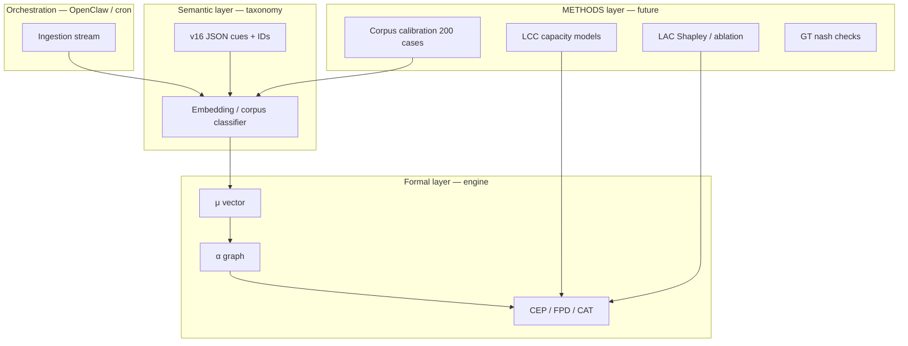

#  vs Engine — formalization gap

> **Status:** architectural issue · **Criticality:** high for v2+  
> Links: [[Taxonomy/00 - Taxonomy index]] · [[errorlogy-mas - active MVP (Claude)]] · [[MAS - orchestrator metrics]]

## The essence of the issue

Taxonomy v16 (`errorlogy_unified_taxonomy_v16.json`) - **381 mode universe**, of which **217 atomic** (189 CB cognitive biases + SF + MP).  
Most of the entries are **ontology + operational_signal** (“how to recognize bias/failure in the text of a decision”), and not **closed formula**.

Engine v1-math (`mas/engine/`) - **thin formal layer** on top of the μ vector and several aggregates.

**Do not confuse:** “CB-001 mode activated μ=0.72” ≠ “confirmation bias was experimentally measured.”

---

## Two layers in one JSON

| Layer | Contents | Share v16 |
|------|-----------|-----|
| **Semantic** | name, definition, operational_signal, layers L1–L6, meta R/O/A/C/T/X | ~80–90% |
| **Formal** | α-edges, PNO components, ACC archetypes, WMS signal types, CAT IDs | ~10–20% |

Atomic mode example - typical **bias entry**:

- `CB-001` Confirmation bias  
- `operational_signal`: «Policy cites only supporting studies…»  
- `meta_dimensions`: `["R"]`

This is a **cue for detection**, not an equation.

---

## What the engine actually uses

| Module | From JSON | Formality |
|--------|---------|--------------|
| **fuzzy** | 217 atomic + universe; meta_dimensions, operational_signal, layer | Heuristics TF-IDF + keyword overlap + weights 0.35/0.25/0.20… |
| **alpha** | alpha_matrix edges + weight | **Yes** - NetworkX, TZ §9.4 |
| **wms/CEP** | WMS signal types | **Yes** — MSI + CEP(t); input = Scout/heuristic |
| **pno** | PNO composites | mean(μ components) |
| **acc** | 10 archetypes + signature_modes | cluster_score formula |
| **cat** | CAT IDs | rule engine; sympy - metadata |
| **fpd** | horizons | sigmoid trajectory |
| **egd/t4d** | keywords, EGD layer | heuristics |

**189 CB biases** do not have individual formulas - they compete through a common text-matcher.

---

## What is stated in JSON, but not in v1 code

| Block | counts/description | engine v1 |
|------|-------------------|-----------|
| METHODS | 42 modules (mining, causal, simulation) | ❌ |
| LCC | capacity gap, blocker-agents | ❌ |
| LAC | Shapley, counterfactual ablation | ❌ (LBI = LLM) |
| GT/HM/GT_EXT | game theory, homo-MAS | ❌ |
| L.C.J. | legal contours | ❌ |
| LΩ | generative topology | ❌ |
| SOCIAL_MEDIA | 59 platforms | ❌ |
| α `confidence` / `evidence_basis` | on the ribs | not used in propagation |

---

## Evaluation of “mathematization”

| Component | ~% formalization |
|-----------|-----------------|
| CB/SF/MP catalog (217) | 5–10% |
| Meta-dimensions R/O/A/C/T/X | 30% (keyword hits) |
| Alpha graph | 70% |
| WMS/CEP/FPD | 60% |
| PNO/ACC | 40% |
| CAT/T4D | 25% |
| METHODS, LCC, LAC, GT, LΩ | 0–5% |

---

## Strategy v2+ (different AI + math architectures)

### Solution directions

1. **Corpus + calibration** — μ  labeled cases,  keyword heuristic.  
2. **Embeddings per mode** — operational_signal → vector; cosine vs case chunks.  
3. **METHODS  plugins** —  LAC-M / WMS-M / ACC-M =  .  
4. **α confidence damping** — weight × confidence  JSON.  
5. **Hybrid agents** — engine , LLM  narrative ( v1 split).  
6. **OpenClaw** — ingestion + schedule;   math.

---

## Formalization maturity criteria

|  | Description |
|---------|----------|
| L0 |  + cues ( taxonomy) |
| L1 | Heuristic μ + graph (engine v1) ✅ |
| L2 | Persisted CEP + time series |
| L3 | Calibrated μ on corpus |
| L4 | METHODS modules wired |
| L5 | Multi-arch validation (engine vs LLM vs ensemble) |

---

## Tags

#taxonomy #engine #formalization #architecture #v2 #errorlogy-mas

→ [[00 — Home]] · [[Artifact map]] · [[MAS — orchestrator metrics]]
