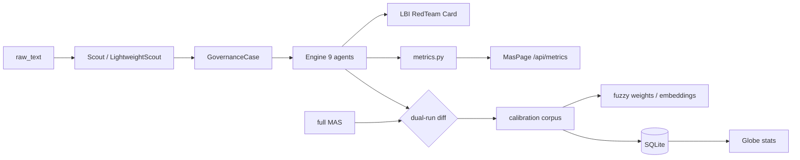

# Анализ Claude — состояние engine v1 (cross-validated)

> **Дата:** 2026-06-01 · **Проверено:** Cursor (pytest + smoke run)  
> Связи: [[errorlogy-mas — активный MVP (Claude)]] · [[Таксономия vs Engine — formalization gap]] · [[MAS — метрики оркестратора]]

Cross-validation анализа Claude Code против текущего репо `errorlogy-mas/` + `errorlogy-gui/`.

---

## 1. Структура движка (подтверждено)

| Engine (9) | Модуль | LLM (5) |
|------------|--------|---------|
| wms | `engine/wms.py` | scout |
| classifier | `engine/fuzzy.py` | lbi |
| alpha | `engine/alpha.py` (networkx) | red_team |
| pno | `engine/pno.py` | card_compiler |
| acc | `engine/acc.py` | neutrality |
| egd, t4d, cat, fpd | keyword / rules / sigmoid | |

Дополнительно: `mas/metrics.py`, GUI MasPage/GlobePage, `/api/metrics`, `/api/stats/countries`.

**Тесты:** 16/16 pytest green.

---

## 2. Что работает хорошо (подтверждено)

- `guards.py` — μ-cap weak evidence (≤0.65)
- `fuzzy.py` — atomic + universe scoring (317+ modes)
- `alpha.py` — networkx propagation, не LLM
- `engine_only=True` — воспроизводимый pipeline без LLM
- **Метрики** — см. §3.1 (исправлено после анализа Claude)

---

## 3. Системные проблемы

### 3.1 ~~Критично: метрики не в оркестраторе~~ → **ИСПРАВЛЕНО v0.2.2**

Claude анализировал версию **до** wiring. Сейчас в `orchestrator.py`:

- `start_run` / `finish_run` — full + engine_only paths
- `track_engine("wms"|"classifier"|…)` — все 9 engine шагов
- `record_llm()` — через `agents/base.py` `_call()`
- `metadata.pipeline_metrics` — в `CaseAnalysis`

Smoke: engine run → **9 steps** в metrics, `pipeline_metrics in meta: True`.

GUI `/#/mas` показывает данные **после хотя бы одного Analyze** в сессии API.

### 3.2 Калибровка fuzzy — **подтверждено**

```python
# engine/fuzzy.py::score_mode — hardcoded, не calibrated
mu = 0.35*dimension + 0.25*keyword + 0.20*signal + 0.10*layer + 0.10*boost
```

Нет feedback loop от labeled cases.

### 3.3 PNO — **частично подтверждено**

| Утверждение Claude | Факт |
|---------------------|------|
| `_family_weights()` dead code | ✅ не вызывается |
| JSON без `components` → нулевой скор | ❌ **components есть** в v16 (`composite_patterns.PNO[].components.{CB,SF,MP}`) |
| Скоринг только family-boost | ❌ `score_pno` читает components + layer boost |

Проверка: smoke run → `dominant_pno = PNO-1` (не нулевой профиль).

**Tech debt:** удалить `_family_weights()`; выровнять ID `PNO-001` vs `PNO-1` в naming.

### 3.4 T4D / EGD — **подтверждено**

- `t4d.py` — `_STAGE_KEYWORDS` с `"1977"`, `"teleconference"`, `"explosion"` → Challenger-biased
- `egd.py` — hardcoded `CB-019`, `CB-028`, `CB-027`

Для не-английских / не-catastrophe кейсов — риск ложной классификации.

### 3.5 CAT — **подтверждено**

5 lambda-правил; fallback `CAT-000`. CAT-002 зависит от `"capacity" in cluster_name.lower()` — хрупко.

### 3.6 Globe seed — **подтверждено**

`country_stats_seed.json` статичен; результаты Analyze не persist → Globe не обновляется автоматически.

---

## 4. Системное решение (Claude) — согласовано

### Уровень 1 — Bootstrap corpus

Full MAS на 5 seed-кейсах OLD SKETCH → `CaseAnalysis` как pseudo-ground-truth → `scipy.optimize` для весов fuzzy.

### Уровень 2 — LLM→Engine→LLM sandwich

Scout уже структурирует вход. **Gap:** `engine_only` использует `_heuristic_weak_signals` (keyword).  
**Proposal:** LightweightScout — 1 LLM call только на структуру, остальное engine.

### Уровень 3 — Dual-run self-calibration

```
engine_only (0.5s)  vs  full MAS (60–120s)
→ diff top_modes / pno / cat
→ RedTeam flags → human queue → weight updates
```

### Таксономия: embeddings вместо TF-IDF

`sentence-transformers/paraphrase-multilingual-MiniLM-L12-v2` — multilingual, local, ~420MB.

Precompute `embed(operational_signal)` per mode at taxonomy load.

→ см. [[Таксономия vs Engine — formalization gap]] L2–L5.

---

## 5. Приоритетная очередь (обновлённый статус)

| # | Задача | Статус | Сложность |
|---|--------|--------|-----------|
| 1 | Metrics → orchestrator | ✅ v0.2.2 | — |
| 2 | PNO dead code + ID fix | ✅ TZ-001 | — |
| 3 | Import 5 seed cases | ✅ TZ-003 (`scripts/seed_corpus.py`) | — |
| 4 | Dual-run comparison | ✅ `?dual_run=true`, `mas/dual_run.py` | — |
| 5 | Sentence embeddings | ✅ `mas/engine/embeddings.py` (fallback TF-IDF) | — |
| 6 | SQLite persistence | ✅ `mas/db.py`, `pipeline_runs` | — |
| 7 | T4D/EGD de-Challengerize | ✅ TZ-001 (EGD synthetic removed) | — |
| 8 | Globe ← analyze results | ✅ `country_stats_globe()` + DB-first API | — |
| 9 | LightweightScout | ✅ `?structure_only=true` | — |
| 10 | Metrics persist | ✅ `pipeline_runs` + MasPage merge | — |

### Feedback после реализации (2026-06-01)

- Seed corpus: кейсы **различаются** (chernobyl → CAT-003, iraq → MP-005 μ=0.94); 4/5 CAT-000 — нормально для heuristic engine.
- CEP одинаковый 0.269 на всех seed — weak signals heuristic даёт один профиль WMS; нужна калибровка или LightweightScout.
- Embeddings: `ERRORLOGY_USE_EMBEDDINGS=0` для быстрых тестов; model download при первом включении.
- Globe API: `source: database` когда DB не пуста; seed fallback сохранён.

---

## 6. Mermaid — целевая архитектура v2



---

## Теги

#analysis #claude #engine #calibration #v2 #cross-validated

→ [[00 — Главная]] · [[Для AI-агентов]]
