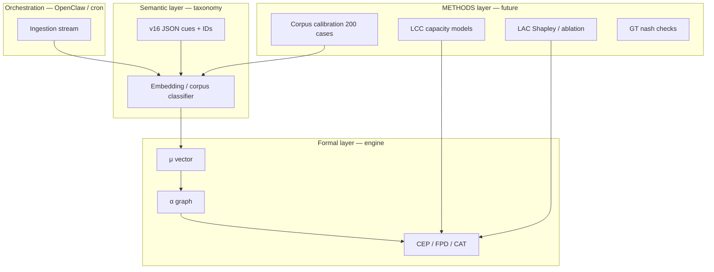

# Таксономия vs Engine — formalization gap

> **Статус:** архитектурный вопрос · **Критичность:** высокая для v2+  
> Связи: [[Таксономия/00 — Индекс таксономии]] · [[errorlogy-mas — активный MVP (Claude)]] · [[MAS — метрики оркестратора]]

## Суть вопроса

Таксономия v16 (`errorlogy_unified_taxonomy_v16.json`) — **381 mode universe**, из них **217 atomic** (189 CB cognitive biases + SF + MP).  
Большая часть записей — **онтология + operational_signal** («как распознать bias/сбой в тексте решения»), а не **закрытая формула**.

Engine v1-math (`mas/engine/`) — **тонкий формальный слой** поверх вектора μ и нескольких агрегатов.

**Нельзя путать:** «режим CB-001 активирован μ=0.72» ≠ «экспериментально измерили confirmation bias».

---

## Два слоя в одном JSON

| Слой | Содержание | Доля v16 |
|------|------------|----------|
| **Семантический** | name, definition, operational_signal, layers L1–L6, meta R/O/A/C/T/X | ~80–90% |
| **Формальный** | α-edges, PNO components, ACC archetypes, WMS signal types, CAT IDs | ~10–20% |

Пример атомарного режима — типичная **bias-запись**:

- `CB-001` Confirmation bias  
- `operational_signal`: «Policy cites only supporting studies…»  
- `meta_dimensions`: `["R"]`

Это **cue для детекции**, не уравнение.

---

## Что engine реально использует

| Модуль | Из JSON | Формальность |
|--------|---------|--------------|
| **fuzzy** | 217 atomic + universe; meta_dimensions, operational_signal, layer | Эвристика TF-IDF + keyword overlap + веса 0.35/0.25/0.20… |
| **alpha** | alpha_matrix edges + weight | **Да** — NetworkX, TZ §9.4 |
| **wms/CEP** | WMS signal types | **Да** — MSI + CEP(t); вход = Scout/heuristic |
| **pno** | PNO composites | mean(μ components) |
| **acc** | 10 archetypes + signature_modes | cluster_score formula |
| **cat** | CAT IDs | rule engine; sympy — metadata |
| **fpd** | horizons | sigmoid trajectory |
| **egd/t4d** | keywords, EGD layer | эвристики |

**189 CB biases** не имеют индивидуальных формул — конкурируют через общий text-matcher.

---

## Что в JSON заявлено, но не в коде v1

| Блок | counts / описание | engine v1 |
|------|-------------------|-----------|
| METHODS | 42 модуля (mining, causal, simulation) | ❌ |
| LCC | capacity gap, blocker-agents | ❌ |
| LAC | Shapley, counterfactual ablation | ❌ (LBI = LLM) |
| GT / HM / GT_EXT | game theory, homo-MAS | ❌ |
| LCJ | legal contours | ❌ |
| LΩ | generative topology | ❌ |
| SOCIAL_MEDIA | 59 platforms | ❌ |
| α `confidence` / `evidence_basis` | на рёбрах | не используется в propagation |

---

## Оценка «математизации»

| Компонент | ~% формализации |
|-----------|-----------------|
| CB/SF/MP catalog (217) | 5–10% |
| Meta-dimensions R/O/A/C/T/X | 30% (keyword hits) |
| Alpha graph | 70% |
| WMS / CEP / FPD | 60% |
| PNO / ACC | 40% |
| CAT / T4D | 25% |
| METHODS, LCC, LAC, GT, LΩ | 0–5% |

---

## Стратегия v2+ (разные архитектуры AI + math)

### Направления решения

1. **Corpus + calibration** — μ из labeled cases, не keyword heuristic.  
2. **Embeddings per mode** — operational_signal → vector; cosine vs case chunks.  
3. **METHODS как plugins** — каждый LAC-M / WMS-M / ACC-M = отдельный модуль.  
4. **α confidence damping** — weight × confidence из JSON.  
5. **Hybrid agents** — engine числа, LLM только narrative (текущий v1 split).  
6. **OpenClaw** — ingestion + schedule; не подменяет math.

---

## Критерии зрелости formalization

| Уровень | Описание |
|---------|----------|
| L0 | Каталог + cues (сейчас taxonomy) |
| L1 | Heuristic μ + graph (engine v1) ✅ |
| L2 | Persisted CEP + time series |
| L3 | Calibrated μ on corpus |
| L4 | METHODS modules wired |
| L5 | Multi-arch validation (engine vs LLM vs ensemble) |

---

## Теги

#taxonomy #engine #formalization #architecture #v2 #errorlogy-mas

→ [[00 — Главная]] · [[Карта артефактов]] · [[MAS — метрики оркестратора]]
