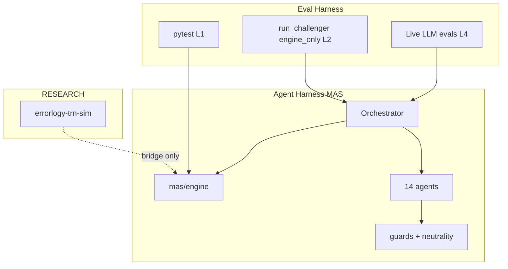

# Маппинг harness engineering → Errorlogy

---

## errorlogy-mas (ACTIVE)

### Agent harness (production)

| Компонент | Путь | Harness-роль |
|-----------|------|----------------|
| Orchestrator | `mas/orchestrator.py` | Цикл 14 агентов, `engine_only`, `structure_only`, dual-run |
| Engine | `mas/engine/*` | Детерминированный слой — **ядро**, не LLM |
| Agents | `mas/agents/*` | Промпты, LANGUAGE_RULES, narrative после engine |
| Guards | `mas/engine/guards.py` | Weak-evidence μ cap, warnings → Red Team |
| Schemas | `mas/schemas/analysis.py` | Contract для graders |
| Dual-run | `tests/test_dual_run.py`, orchestrator flags | Детекция drift между прогонами |
| Neutrality | `agents/neutrality*.py` | Language compliance — кандидат на LLM-rubric eval |

### Eval harness (сегодня)

| Артефакт | Тип | CI |
|----------|-----|-----|
| `pytest tests/` | L1 unit + integration | ✅ каждый PR |
| `run_challenger.py --engine-only` | L2 smoke eval | ✅ каждый PR |
| `run_challenger.py` (full) | L4 live E2E | локально, нужны keys |
| `examples/run_challenger.py` кейс Challenger | Golden seed case | фиксированный текст STS-51L |

### Пробелы (целевые для harness spec)

- Per-agent eval YAML (Scout extraction, Neutrality violations)
- Recorded outputs / cassettes для regression без live LLM
- API-level eval (`POST /analyze`) с schema assertions
- Метрики latency per agent step (SSE уже в GUI — источник для eval)

---

## errorlogy-gui / errorlogy-gui-v2 (ACTIVE)

| Зона | Harness-связь |
|------|----------------|
| `errorlogy-gui` Analyze | UI для full / `engine_only` / LightweightScout / dual-run |
| `src/lib/api.ts` | Contract client — eval на breaking API changes |
| `errorlogy-gui-v2` | Browser UI прогноза — smoke `npm run build` в CI |
| SSE step progress | Observability surface для manual + future automated trace compare |

GUI evals — **contract + build**, не LLM quality (quality — на MAS).

---

## errorlogy-trn-sim (RESEARCH)

| Правило | Деталь |
|---------|--------|
| Отдельный harness | `run_experiments.py`, CSV outputs, `validate_outputs.py` |
| Bridge | `bridge/egd_stub.py` — единственная точка соприкосновения с MAS engine |
| Eval focus | Polarization / anticonsensus метрики, не 14-agent narrative |

Не переносить trn-sim eval patterns в `mas/agents/` без explicit migration.

---

## OSS integration funnel

| Стадия | Harness-активность |
|--------|-------------------|
| Discover | Запись eval-tool в `research/oss-candidates.yaml`, `target_area: mas` или `infra` |
| Screen | Оси `test_safety`, `engine_llm_fit` — критичны для harness tools |
| Spike | POC: один агент + `templates/harness-spec.yaml` |
| Pilot | Opt-in flag, default off; CI green обязателен |
| Adopt | Документация в этом handbook, тесты в `errorlogy-mas/tests/` |

См. [05-next-steps.md](05-next-steps.md) для конкретных кандидатов.

---

## CI pipeline (текущий = минимальный eval harness)

```text
push/PR → pytest (MAS) → run_challenger --engine-only → npm run build (GUI)
```

Это **quality gate** уровня Pilot→Adopt из [`oss-integration-funnel.md`](../../oss-integration-funnel.md).

---

## Диаграмма: где что живёт


