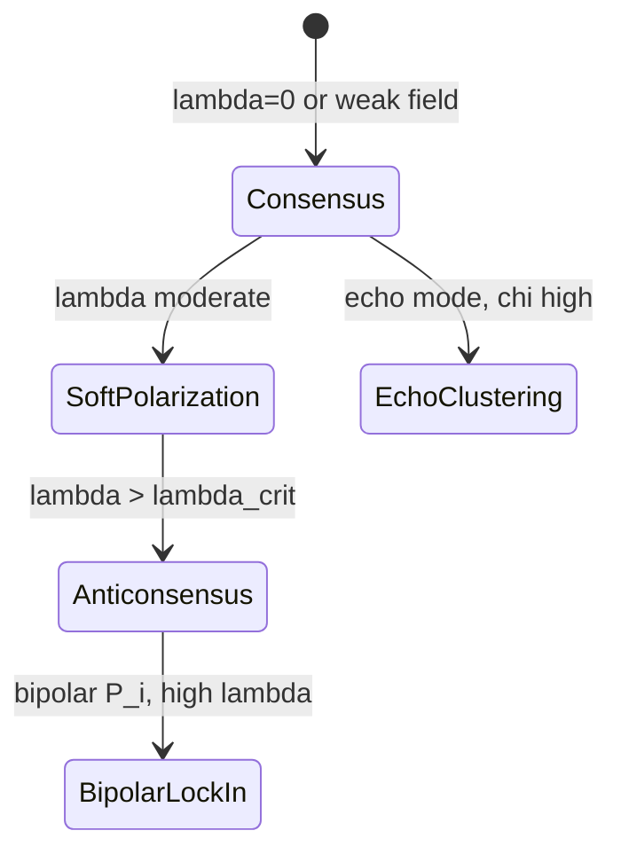

# TRN theory: synthetic research framework

TRN (Trans-Reactive Network) in this package — **abstract class** , not a model of a specific platform. Formal apparatus: [MATHEMATICAL_MODEL.md](MATHEMATICAL_MODEL.md). Phase diagram: [PHASE_DIAGRAM.md](PHASE_DIAGRAM.md).

---

## 1. Definition

TRN — - , :

1. **observes** \(\mathbf{x}(t)\);
2. **forms** \(P_i(t)\);
3. **acts on** coupling \(I_i(t)\);
4. **receives feedback** \(C,\mathrm{Pol},\mathrm{Ext},H,R_{\mathrm{TRN}}\).

Closed loop « ↔ » studied in regimes of , , .

---

## 2. Modeling object

Population \(N\) agents on graph \(G\) \(W\). Each agent carries opinion \(b_i\in[-1,1]\), \(e_i\), \(q_i\), \(r_i\), \(m_i\).

**Two sources of opinion change:**

- **social** \(S_i\) — bounded confidence ( );
- **TRN** \(I_i\) — attraction to narrative pole \(P_i\).

Without \(\lambda=0\) environment is passive; \(\lambda>0\) trans-reactive coupling activates.

---

## 3. Agent typology L1–L5 ( AGI/ASI)

Levels — **parameter distributions**, not ontological types:

| | Name | | Behavior in model |
|---:|---|---|---|
| L1 | Reactive | \(e_i\); `rho`, `delta` | Emotion grows from conflict \(|P_i-b_i|\); \(\beta_1\) increases attention \(A_i\) |
| L2 | Mimetic | \(m_i\), \(\alpha_i\) | \(m_i\) scales TRN; \(\alpha_i\) — imitation rate of neighbors |
| L3 | Narrative | \(P_i\), \(\chi\) | Sensitivity to local/global narrative |
| L4 | Reflective | \(q_i\) | Multiplier \((1-q_i)\) suppresses TRN |
| L5 | Strategic | \(r_i\) | Multiplier \((1-r_i)\) suppresses TRN |

**Example stress profile** (`stress_config.json`): \(\bar q,\bar r\) (L4–L5 weakened), \(\bar m\) (L2 strengthened) → \(\bar\phi=\bar m(1-\bar r)(1-\bar q)\).

---

## 4. System regimes

| | | |
|---|---|---|
| | \(C\gtrsim 0.9\), \(\mathrm{Ext}\approx 0\) | \(\lambda=0\) echo + \(q,r\) |
| | \(0.3<\mathrm{Pol}<0.55\), \(\mathrm{Ext}<0.35\) | \(\lambda\approx 0.2\) (stress) |
| () | \(\mathcal{A}=1\) | . §5 |
| Bipolar lock-in | \(\mathrm{Ext}\to 1\), \(\pm 1\) | bipolar + \(\lambda\ge 0.4\) |

---

## 5. :

— **** « ». :

1. low ;
2. ;
3. **** ;
4. () — .

** ** (`metrics.py`):

\[
\mathcal{A}=1 \iff C<0.45,\ \mathrm{Pol}>0.44,\ \mathrm{Ext}>0.35,
\]

\(\mathrm{Ext}\) \(|b_i|>0.65\).

**Link to \(R_{\mathrm{TRN}}\):**

\[
R_{\mathrm{TRN}}=\frac{\lambda\bar m(1-\bar r)(1-\bar q)\chi}{\bar h+\varepsilon}.
\]

« » (strengthened ) \(\bar h\) ( ). stress- \(\mathcal{A}=1\) \(R_{\mathrm{TRN}}\approx 1.2\).

** 0.45 / 0.44 / 0.35** — bipolar stress, . \(\mathrm{Pol}>0.44\) \(C=1-\mathrm{Pol}\) (. MATHEMATICAL_MODEL §6.5).

---

## 6.

( \(\mathcal{A}=1\)) ** ** :

\[
\lambda\uparrow,\quad \bar m\uparrow,\quad \bar q\downarrow,\quad \bar r\downarrow,\quad \chi\uparrow\ (\text{echo}),\quad \bar h\downarrow.
\]

** ** sweep \(\lambda\) (`outputs/stress/lambda_sweep.csv`): \(\mathcal{A}\)-rate 0 → 1 \(\lambda=0.2\) \(0.4\).

**:** \(\lambda=0\) \(q,r,\chi\) ** ** — \(q,r,\chi\) \(\lambda>0\).

---

## 7.

bipolar stress- observes **** ( ) :

\[
\lambda_{\mathrm{crit}}^{\mathrm{emp}}\approx 0.35\pm 0.05.
\]

Mean-field \(\lambda_{\mathrm{crit}}^{\mathrm{MF}}\approx 0.49\) — (. MATHEMATICAL_MODEL §7.3).

** :** \(\lambda<\lambda_{\mathrm{crit}}\) social \(S_i\) ; \(\lambda>\lambda_{\mathrm{crit}}\) TRN \(\pm 1\) , → \(\mathrm{Ext}\) \(\mathcal{A}\).

---

## 8. Link to Errorlogy

| Errorlogy (MAS) | TRN- |
|---|---|
| EGD `echo_room_pressure` | \(\lambda\), \(\chi\) ( `egd_stub.py`) |
| EGD `hidden_signal_prior` | \(\bar h\) ( ) |
| v16, \(\mu\) | **** \(R_{\mathrm{TRN}}\) \(\mathcal{A}\) |
| 14-agent pipeline | **** ; RESEARCH- |

TRN- ** ** ( , ), MAS.

---

## 9.

- Stress: `python run_experiments.py --config configs/stress_config.json --out outputs/stress --sweep`
- Echo baseline: `configs/sweep_config.json`
- CSV: `scripts/validate_outputs.py outputs --recursive`

: [EXPERIMENT_PROTOCOL.md](EXPERIMENT_PROTOCOL.md).

---

## 10.

1. \(b_i\); .
2. \(q,r\) — TRN.
3. Bipolar \(z_i\) — «».
4. + clip; \(\theta\).
5. .

---

## 11.

1. \(R_{\mathrm{TRN}}\gtrsim 1\) \(\mathcal{A}\) stress-?
2. \(\lambda_{\mathrm{crit}}(\bar q,\bar r)\) \(\lambda\)?
3. \(K_{\mathrm{clusters}}\) bipolar lock-in?
4. `egd_stub` \(\mu\) ?

alsifiable — MATHEMATICAL_MODEL §12.
