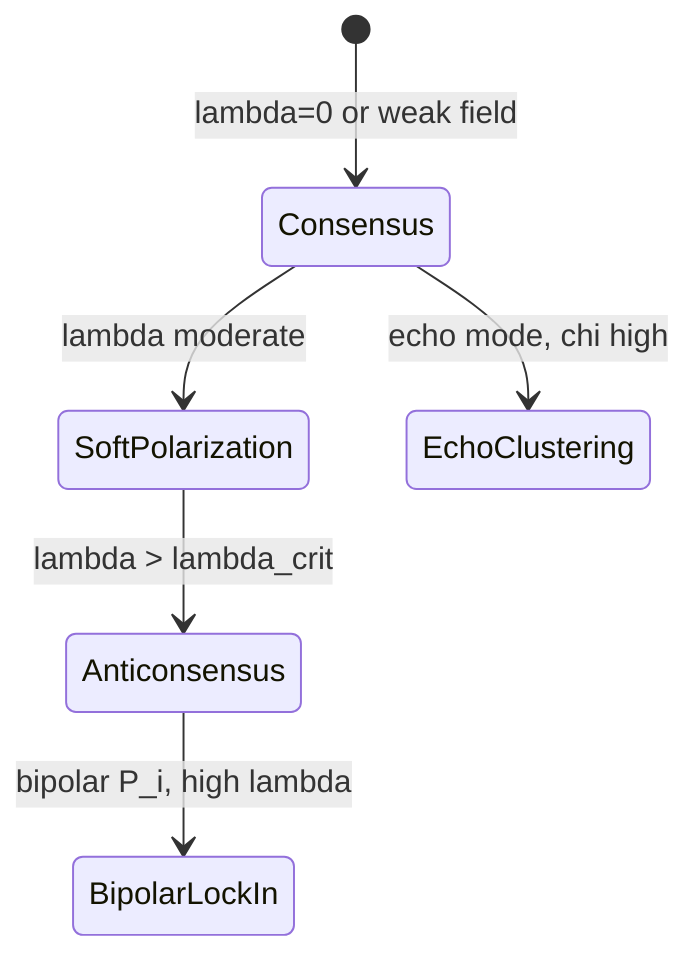

# Теория TRN: синтетическая исследовательская рамка

TRN (Trans-Reactive Network) в этом пакете — **абстрактный класс** информационных сред, не модель конкретной платформы. Формальный аппарат: [MATHEMATICAL_MODEL.md](MATHEMATICAL_MODEL.md). Фазовая диаграмма: [PHASE_DIAGRAM.md](PHASE_DIAGRAM.md).

---

## 1. Определение

TRN — транс-реактивная информационная среда, которая:

1. **наблюдает** состояние синтетических агентов \(\mathbf{x}(t)\);
2. **формирует** локальное нарративное поле \(P_i(t)\);
3. **воздействует** на динамику мнений через coupling \(I_i(t)\);
4. **получает обратную связь** через метрики \(C,\mathrm{Pol},\mathrm{Ext},H,R_{\mathrm{TRN}}\).

Замкнутый контур «среда ↔ агенты» изучается в режимах консенсуса, мягкой поляризации, кластеризации и антиконсенсуса.

---

## 2. Объект моделирования

Популяция \(N\) агентов на графе \(G\) с матрицей влияния \(W\). Каждый агент несёт мнение \(b_i\in[-1,1]\), эмоцию \(e_i\), параметры фильтрации \(q_i\), устойчивости \(r_i\), восприимчивости \(m_i\).

**Два источника изменения мнения:**

- **социальный** \(S_i\) — bounded confidence (локальный консенсус);
- **TRN** \(I_i\) — притяжение к нарративному полюсу \(P_i\).

Без \(\lambda=0\) среда пассивна; при \(\lambda>0\) включается trans-reactive coupling.

---

## 3. Типология агентов L1–L5 (без AGI/ASI)

Уровни — **распределения параметров**, не онтологические типы:

| Уровень | Название | Параметры | Поведение в модели |
|---:|---|---|---|
| L1 | Reactive | \(e_i\); `rho`, `delta` | Эмоция растёт от конфликта \(|P_i-b_i|\); через \(\beta_1\) повышает внимание \(A_i\) |
| L2 | Mimetic | \(m_i\), \(\alpha_i\) | \(m_i\) масштабирует TRN; \(\alpha_i\) — скорость подражания соседям |
| L3 | Narrative | режим \(P_i\), \(\chi\) | Чувствительность к локальному/глобальному нарративу |
| L4 | Reflective | \(q_i\) | Множитель \((1-q_i)\) подавляет TRN |
| L5 | Strategic | \(r_i\) | Множитель \((1-r_i)\) подавляет TRN |

**Пример stress-профиля** (`stress_config.json`): низкие \(\bar q,\bar r\) (L4–L5 ослаблены), высокое \(\bar m\) (L2 усилен) → высокая \(\bar\phi=\bar m(1-\bar r)(1-\bar q)\).

---

## 4. Режимы системы

| Режим | Признаки | Типичные параметры |
|---|---|---|
| Консенсус | \(C\gtrsim 0.9\), \(\mathrm{Ext}\approx 0\) | \(\lambda=0\) или echo + высокие \(q,r\) |
| Мягкая поляризация | \(0.3<\mathrm{Pol}<0.55\), \(\mathrm{Ext}<0.35\) | \(\lambda\approx 0.2\) (stress) |
| Антиконсенсус (формальный) | \(\mathcal{A}=1\) | см. §5 |
| Bipolar lock-in | \(\mathrm{Ext}\to 1\), два кластера у \(\pm 1\) | bipolar + \(\lambda\ge 0.4\) |

---

## 5. Антиконсенсус: определение и пороги

Антиконсенсус — **не** просто «мнения разошлись». Это устойчивый режим одновременно:

1. низкий общий консенсус;
2. высокая дисперсия мнений;
3. высокая доля **крайних** позиций;
4. (концептуально) слабое межкластерное взаимодействие — пока не формализовано в коде.

**Операционное определение** (`metrics.py`):

\[
\mathcal{A}=1 \iff C<0.45,\ \mathrm{Pol}>0.44,\ \mathrm{Ext}>0.35,
\]

где \(\mathrm{Ext}\) считает долю агентов с \(|b_i|>0.65\).

**Связь с \(R_{\mathrm{TRN}}\):**

\[
R_{\mathrm{TRN}}=\frac{\lambda\bar m(1-\bar r)(1-\bar q)\chi}{\bar h+\varepsilon}.
\]

Индекс агрегирует «давление среды» в числитель (усиление поля) и нормирует на \(\bar h\) (социальная связность). В stress-сценарии переход к \(\mathcal{A}=1\) совпадает с \(R_{\mathrm{TRN}}\approx 1.2\).

**Пороги 0.45 / 0.44 / 0.35** — эмпирическая калибровка под bipolar stress, не физические константы. Условие \(\mathrm{Pol}>0.44\) избыточно при \(C=1-\mathrm{Pol}\) (см. MATHEMATICAL_MODEL §6.5).

---

## 6. Главная исследовательская гипотеза

Вероятность антиконсенсуса (доля запусков с \(\mathcal{A}=1\)) **не убывает** при:

\[
\lambda\uparrow,\quad \bar m\uparrow,\quad \bar q\downarrow,\quad \bar r\downarrow,\quad \chi\uparrow\ (\text{echo}),\quad \bar h\downarrow.
\]

**Частично подтверждено** sweep по \(\lambda\) (`outputs/stress/lambda_sweep.csv`): \(\mathcal{A}\)-rate с 0 → 1 между \(\lambda=0.2\) и \(0.4\).

**Ограничение:** при \(\lambda=0\) параметры \(q,r,\chi\) **не влияют** на траекторию — гипотеза о \(q,r,\chi\) проверяется только при \(\lambda>0\).

---

## 7. Фазовый переход

При фиксированном bipolar stress-профиле наблюдается **резкий** (не обязательно дискретный в термодинамическом смысле) переход:

\[
\lambda_{\mathrm{crit}}^{\mathrm{emp}}\approx 0.35\pm 0.05.
\]

Mean-field оценка \(\lambda_{\mathrm{crit}}^{\mathrm{MF}}\approx 0.49\) — тот же порядок (см. MATHEMATICAL_MODEL §7.3).

**Ключевой механизм:** при \(\lambda<\lambda_{\mathrm{crit}}\) социальный член \(S_i\) сглаживает мнения к центру; при \(\lambda>\lambda_{\mathrm{crit}}\) TRN переводит агентов к назначенным полюсам \(\pm 1\) быстрее, чем соседи успевают компенсировать → рост \(\mathrm{Ext}\) и срабатывание \(\mathcal{A}\).

---

## 8. Связь с Errorlogy

| Errorlogy (MAS) | TRN-симуляция |
|---|---|
| EGD `echo_room_pressure` | \(\lambda\), \(\chi\) (эвристика в `egd_stub.py`) |
| EGD `hidden_signal_prior` | \(\bar h\) (узкое окно доверия) |
| Таксономия v16, \(\mu\) | **не** отождествлять с \(R_{\mathrm{TRN}}\) или \(\mathcal{A}\) |
| 14-agent pipeline | **не** интегрирован; RESEARCH-слой |

TRN-симуляция **усиливает теорию** (динамика поля, пороги), не заменяет анализ кейсов в MAS.

---

## 9. Протокол и воспроизводимость

- Stress: `python run_experiments.py --config configs/stress_config.json --out outputs/stress --sweep`
- Echo baseline: `configs/sweep_config.json`
- Валидация CSV: `scripts/validate_outputs.py outputs --recursive`

Подробности: [EXPERIMENT_PROTOCOL.md](EXPERIMENT_PROTOCOL.md).

---

## 10. Ограничения модели

1. Одномерное мнение \(b_i\); нет тематических осей.
2. \(q,r\) не фильтруют социальное влияние — только TRN.
3. Bipolar \(z_i\) фиксированы — нет эндогенной смены «лагеря».
4. Явный Эйлер + clip; нет доказательства глобальной устойчивости при всех \(\theta\).
5. Пороги антиконсенсуса не калиброваны на эмпирических социальных данных.

---

## 11. Открытые вопросы

1. Универсален ли \(R_{\mathrm{TRN}}\gtrsim 1\) как предиктор \(\mathcal{A}\) вне stress-профиля?
2. Какова форма \(\lambda_{\mathrm{crit}}(\bar q,\bar r)\) при фиксированном \(\lambda\)?
3. Нужна ли метрика \(K_{\mathrm{clusters}}\) для отличия антиконсенсуса от bipolar lock-in?
4. Как калибровать `egd_stub` без подмены \(\mu\) вероятностью?

Фalsifiable план экспериментов — MATHEMATICAL_MODEL §12.
